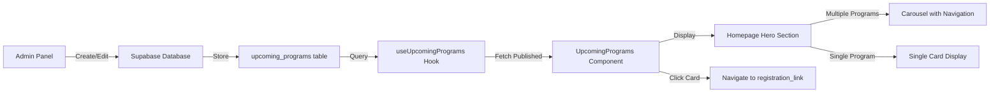

# Upcoming Programs Hero Feature

## Overview

Add an upcoming programs section to the homepage hero area (right side, red boxed area) that displays program cards in a carousel when multiple programs exist. Programs will be managed through the admin panel.

## Implementation Plan

### 1. Database Schema

Create a new `upcoming_programs` table in Supabase with the following fields:

- `id` (UUID, primary key)
- `title` (TEXT, required) - displayed on card
- `image_url` (TEXT, required) - featured image for card
- `start_date` (DATE, required) - displayed on card
- `registration_link` (TEXT, required) - destination when card is clicked
- `status` (ENUM: 'draft', 'published', 'archived')
- `display_order` (INTEGER) - for manual ordering
- `created_at` (TIMESTAMPTZ)
- `updated_at` (TIMESTAMPTZ)

**Note:** Description field removed - cards only display title, date, and image. The entire card is clickable and navigates to registration_link.**File:** `supabase/migrations/[timestamp]_create_upcoming_programs.sql`

### 2. TypeScript Types

Add types for upcoming programs to match the database schema.**File:** `src/integrations/supabase/types.ts` (update existing)

### 3. Custom Hook

Create a hook to fetch upcoming programs from Supabase.**File:** `src/hooks/useUpcomingPrograms.ts`

- `fetchUpcomingPrograms()` - fetch published programs ordered by display_order/start_date
- `fetchAllPrograms()` - for admin (all statuses)
- `createProgram()`, `updateProgram()`, `deleteProgram()` - CRUD operations

### 4. Admin Panel - List Page

Create admin list page to view and manage all programs.**File:** `src/pages/admin/AdminPrograms.tsx`

- DataTable showing all programs with filters (status)
- Columns: Title, Image (thumbnail), Start Date, Registration Link, Status, Display Order
- Actions: Edit, Delete, Publish/Unpublish
- Search functionality by title
- Add new program button
- Drag-to-reorder or manual display_order input for ordering

### 5. Admin Panel - Editor Page

Create editor page for creating/editing programs.**File:** `src/pages/admin/AdminProgramEditor.tsx`

- Form fields:
- `title` (required) - program title
- `image_url` (required) - program image (use ImageUploader component)
- `start_date` (required) - program start date (date picker)
- `registration_link` (required) - URL or route where card click navigates
- `status` - toggle (draft/published)
- `display_order` - integer for ordering
- Image uploader component (reuse existing ImageUploader)
- Save/Cancel buttons

### 6. Admin Sidebar Integration

Add "Upcoming Programs" link to admin sidebar navigation.**File:** `src/components/admin/AdminSidebar.tsx`

- Add new menu item under contentNavItems or create new section

### 7. Upcoming Programs Component

Create a reusable component to display program cards with carousel support.**File:** `src/components/UpcomingPrograms.tsx`

- Fetch published programs using `useUpcomingPrograms` hook
- Display programs in clickable cards with:
- **Image** - featured image (cover image for card, aspect ratio ~16:9)
- **Title** - program title (bold, 1-2 lines max with ellipsis)
- **Date** - formatted start_date using `date-fns` (e.g., "Jan 15, 2024" or "January 15, 2024")
- Entire card is clickable:
- If `registration_link` starts with `http://` or `https://`, use `<a>` tag with `target="_blank"`
- Otherwise, use React Router `<Link>` for internal navigation
- Use existing Carousel component from `src/components/ui/carousel.tsx`
- Show carousel navigation (arrows, dots) when multiple programs exist
- Single program: display without carousel (no arrows/dots)
- Responsive design matching hero section styling
- Empty state: return null or show placeholder message
- Card styling:
- Rounded corners (rounded-lg or rounded-xl)
- Hover effects (scale, shadow increase)
- Shadow (shadow-md, shadow-lg on hover)
- Image overlay gradient for text readability if needed
- Match purple accent color scheme (#7C3AED)

### 8. Hero Section Integration

Update UnifiedHero component to include the upcoming programs section in the right side area.**File:** `src/components/common/UnifiedHero.tsx`

- Modify the skilltori variant layout (lines 54-219):
- Change container from single column to grid layout
- Left column: existing content (greeting, headline, tags, CTAs, stats)
- Right column: `<UpcomingPrograms />` component
- Grid layout: `lg:grid-cols-2` for desktop, single column on mobile
- Spacing: Match existing padding and gap patterns
- Alignment: Center align programs vertically with left content
- Responsive: Stack vertically on mobile (grid-cols-1)
- Ensure programs section doesn't break hero section height/alignment

### 9. Row Level Security (RLS)

Set up RLS policies for the upcoming_programs table:

- Public read access for published programs
- Admin write access for all operations

**File:** `supabase/migrations/[timestamp]_create_upcoming_programs.sql` (include RLS policies)

## Data Flow




## Implementation Details

### Card Component Structure

```tsx
<Card className="cursor-pointer hover:scale-105 transition-all">
  <CardContent className="p-0">
    
    <div className="p-4">
      <h3>{title}</h3>
      <p>{formattedDate}</p>
    </div>
  </CardContent>
</Card>
```


### Link Handling Logic

- Check if `registration_link` starts with `http://` or `https://`
- External: `<a href={link} target="_blank" rel="noopener noreferrer">`
- Internal: `<Link to={link}>` (React Router)

### Date Formatting

- Use `date-fns` format function: `format(start_date, 'MMM d, yyyy')`
- Example: "Jan 15, 2024" or "January 15, 2024"

## Key Design Decisions

- **Card Design**: Simple cards with only title, date, and image - no description field
- **Clickable Cards**: Entire card is clickable and navigates to registration_link
- **Placement**: Programs display in the right side of hero (red boxed area shown in screenshot)
- **Carousel**: Automatically activates when 2+ programs exist, shows navigation arrows and dots
- **Visibility**: Only published programs show on homepage
- **Ordering**: Admin can reorder programs via display_order field
- **Responsive**: Cards stack vertically on mobile, side-by-side carousel on desktop
- **Registration Link**: Can be internal route (e.g., `/courses/xyz`) or external URL

## Files to Create/Modify

### New Files

1. `supabase/migrations/[timestamp]_create_upcoming_programs.sql` - Database migration
2. `src/hooks/useUpcomingPrograms.ts` - Custom hook for CRUD operations
3. `src/components/UpcomingPrograms.tsx` - Display component with carousel
4. `src/pages/admin/AdminPrograms.tsx` - Admin list page
5. `src/pages/admin/AdminProgramEditor.tsx` - Admin editor page

### Modified Files

1. `src/integrations/supabase/types.ts` - Add upcoming_programs table types
2. `src/components/common/UnifiedHero.tsx` - Add programs section to hero
3. `src/components/admin/AdminSidebar.tsx` - Add navigation menu item
4. `src/App.tsx` - Add routes for admin pages (if not auto-discovered)

## Testing Checklist

- [ ] Create program via admin panel
- [ ] Edit program via admin panel
- [ ] Delete program via admin panel
- [ ] Publish/unpublish program
- [ ] Reorder programs (display_order)
- [ ] Single program displays without carousel
- [ ] Multiple programs display in carousel
- [ ] Carousel navigation works (arrows, dots)
- [ ] Card click navigates to registration_link (internal)
- [ ] Card click navigates to registration_link (external, new tab)
- [ ] Responsive: mobile stacks, desktop shows side-by-side
- [ ] Empty state when no programs